# read-text.vim

Vim/Neovim plugin for text-to-speech using denops.vim.

## Overview

This plugin reads aloud text in Vim/Neovim using various TTS engines.

```mermaid
flowchart LR
    subgraph Vim/Neovim
        A[Text]
    end
    subgraph TTS Engine
        B[kokoro-tts]
        C[VOICEVOX]
        D[espeak]
        E[MeloTTS]
    end
    subgraph Audio Player
        F[mpv / aplay / ...]
    end

    A --> B & C & D & E
    B & C & D & E -->|WAV/MP3| F
    F -->|Sound| G((🔊))
```



### Requirements

- Vim 8.2+ or Neovim 0.5+
- [denops.vim](https://github.com/vim-denops/denops.vim)
- [Deno](https://deno.land/) 1.40+
- One of the supported TTS engines

## Supported TTS Engines

| Engine | Description |
|--------|-------------|
| [kokoro-tts](https://github.com/nazdridoy/kokoro-tts) | High-quality, offline, multi-language |
| [VOICEVOX](https://voicevox.hiroshiba.jp/) | High-quality Japanese (requires server) |
| [espeak](http://espeak.sourceforge.net/) | Lightweight, multi-language |
| [MeloTTS](https://github.com/myshell-ai/MeloTTS) | High-quality, multi-language (requires Python) |

See [doc/providers.md](doc/providers.md) for detailed setup instructions.

## Audio Players

| Player | Platform | Description |
|--------|----------|-------------|
| aplay | Linux (ALSA) | Default, lightweight |
| paplay | Linux (PulseAudio) | PulseAudio systems |
| mpv | Cross-platform | Feature-rich, versatile |
| ffplay | Cross-platform | FFmpeg-based |
| afplay | macOS | Built-in macOS player |

```vim
" Example: Use mpv
let g:read_text_audio_command = 'mpv'
let g:read_text_audio_args = ['--no-video', '--really-quiet']
```

See [doc/audio-players.md](doc/audio-players.md) for detailed setup instructions.

## Quick Start (kokoro-tts)

```vim
" Setup audio player
let g:read_text_audio_command = 'mpv'
let g:read_text_audio_args = ['--no-video', '--really-quiet']

" Select TTS provider
let g:read_text_tts_provider = 'kokoro'

" Language and voice settings
let g:read_text_kokoro_lang = 'en-us'
let g:read_text_kokoro_voice = 'af_sarah'

" Key mappings
nmap <leader>rc <Plug>(read-text-from-cursor)
vmap <leader>rc <Plug>(read-text-selection)
nmap <leader>rl <Plug>(read-text-line)
nmap <leader>rs <Plug>(read-text-stop)
```

## Commands

| Command | Description |
|---------|-------------|
| `:ReadFromCursor` | Read from cursor to end of file |
| `:ReadSelection` | Read visual selection |
| `:ReadLine` | Read current line |
| `:ReadTextStop` | Stop reading |

## Key Mappings

| Mapping | Description |
|---------|-------------|
| `<Plug>(read-text-from-cursor)` | Read from cursor |
| `<Plug>(read-text-selection)` | Read selection |
| `<Plug>(read-text-line)` | Read line |
| `<Plug>(read-text-stop)` | Stop reading |

## Documentation

- [doc/providers.md](doc/providers.md) - TTS provider setup and configuration
- [doc/audio-players.md](doc/audio-players.md) - Audio player setup and configuration
- [doc/troubleshooting.md](doc/troubleshooting.md) - Troubleshooting guide

## License

zlib License
